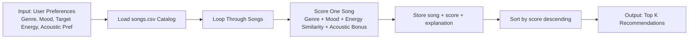

# 🎵 Music Recommender Simulation

## Project Summary

In this project you will build and explain a small music recommender system.

Your goal is to:

- Represent songs and a user "taste profile" as data
- Design a scoring rule that turns that data into recommendations
- Evaluate what your system gets right and wrong
- Reflect on how this mirrors real world AI recommenders

Replace this paragraph with your own summary of what your version does.

---

## How The System Works

Real-world recommenders score each item using many signals, then rank items by predicted fit. My simulation focuses on a transparent content-based vibe match, with strongest priority on `genre` and `mood`, and a closeness-based score for `energy` so songs near the user's target energy are rewarded. This mirrors real recommendation pipelines at a small scale: feature matching first, then ranking top candidates.

`Song` features used in this simulation:

- `genre`
- `mood`
- `energy`
- `tempo_bpm`
- `valence`
- `danceability`
- `acousticness`

`UserProfile` features used in this simulation:

- `favorite_genre`
- `favorite_mood`
- `target_energy`
- `likes_acoustic`

Example user profile for testing:

```python
user_profile = {
      "favorite_genre": "lofi",
      "favorite_mood": "chill",
      "target_energy": 0.40,
      "likes_acoustic": True,
}
```

Profile critique: this profile is broad enough to separate "intense rock" from "chill lofi" because it combines categorical filters (`genre`, `mood`) with a low target energy. To reduce narrowness, test additional profiles (for example, high-energy pop and moody synthwave) and compare recommendations.

Finalized Algorithm Recipe:

- +2.0 points for a `genre` match.
- +1.0 point for a `mood` match.
- +`(1 - abs(song_energy - target_energy))` similarity points for energy closeness.
- +0.5 bonus if `likes_acoustic` is true and `acousticness >= 0.60`.

Scoring Rule vs Ranking Rule:

- Scoring Rule computes one song's fit score using the formula above.
- Ranking Rule sorts all songs by score (highest first) and returns Top K.
- Both are required: scoring evaluates each item, ranking turns many scores into a final recommendation list.

Data Flow Map:



Potential bias note: this system may over-prioritize genre and miss cross-genre songs that match mood and energy; with a small catalog, recommendation diversity is also limited.

Prompts used with Copilot Chat:

- Dataset expansion prompt:
   "Using #file:data/songs.csv, generate 8 new songs in valid CSV rows with the same headers (id,title,artist,genre,mood,energy,tempo_bpm,valence,danceability,acousticness). Use genres and moods not already common in the file, keep numeric values realistic (0.0-1.0 where needed), and avoid duplicates."
- User profile critique prompt:
   "Critique this user profile for recommendation quality: {favorite_genre: lofi, favorite_mood: chill, target_energy: 0.40, likes_acoustic: true}. Will this clearly differentiate intense rock from chill lofi, or is it too narrow? Suggest one broader alternative profile."
- Scoring logic design prompt:
   "Using #file:data/songs.csv, propose point-weighting strategies for a content-based recommender. Compare genre vs mood weight importance, include an energy closeness formula (not just higher/lower), and recommend a final scoring + ranking recipe for Top K output."

---

## Getting Started

### Setup

1. Create a virtual environment (optional but recommended):

   ```bash
   python -m venv .venv
   source .venv/bin/activate      # Mac or Linux
   .venv\Scripts\activate         # Windows

2. Install dependencies

```bash
pip install -r requirements.txt
```

3. Run the app:

```bash
python -m src.main
```

### Running Tests

Run the starter tests with:

```bash
pytest
```

You can add more tests in `tests/test_recommender.py`.

---

## Experiments You Tried

Use this section to document the experiments you ran. For example:

- What happened when you changed the weight on genre from 2.0 to 0.5
- What happened when you added tempo or valence to the score
- How did your system behave for different types of users

---

## Limitations and Risks

Summarize some limitations of your recommender.

Examples:

- It only works on a tiny catalog
- It does not understand lyrics or language
- It might over favor one genre or mood

You will go deeper on this in your model card.

---

## Reflection

Read and complete `model_card.md`:

[**Model Card**](model_card.md)

Write 1 to 2 paragraphs here about what you learned:

- about how recommenders turn data into predictions
- about where bias or unfairness could show up in systems like this


---

## 7. `model_card_template.md`

Combines reflection and model card framing from the Module 3 guidance. :contentReference[oaicite:2]{index=2}  

```markdown
# 🎧 Model Card - Music Recommender Simulation

## 1. Model Name

Give your recommender a name, for example:

> VibeFinder 1.0

---

## 2. Intended Use

- What is this system trying to do
- Who is it for

Example:

> This model suggests 3 to 5 songs from a small catalog based on a user's preferred genre, mood, and energy level. It is for classroom exploration only, not for real users.

---

## 3. How It Works (Short Explanation)

Describe your scoring logic in plain language.

- What features of each song does it consider
- What information about the user does it use
- How does it turn those into a number

Try to avoid code in this section, treat it like an explanation to a non programmer.

---

## 4. Data

Describe your dataset.

- How many songs are in `data/songs.csv`
- Did you add or remove any songs
- What kinds of genres or moods are represented
- Whose taste does this data mostly reflect

---

## 5. Strengths

Where does your recommender work well

You can think about:
- Situations where the top results "felt right"
- Particular user profiles it served well
- Simplicity or transparency benefits

---

## 6. Limitations and Bias

Where does your recommender struggle

Some prompts:
- Does it ignore some genres or moods
- Does it treat all users as if they have the same taste shape
- Is it biased toward high energy or one genre by default
- How could this be unfair if used in a real product

---

## 7. Evaluation

How did you check your system

Examples:
- You tried multiple user profiles and wrote down whether the results matched your expectations
- You compared your simulation to what a real app like Spotify or YouTube tends to recommend
- You wrote tests for your scoring logic

You do not need a numeric metric, but if you used one, explain what it measures.

---

## 8. Future Work

If you had more time, how would you improve this recommender

Examples:

- Add support for multiple users and "group vibe" recommendations
- Balance diversity of songs instead of always picking the closest match
- Use more features, like tempo ranges or lyric themes

---

## 9. Personal Reflection

A few sentences about what you learned:

- What surprised you about how your system behaved
- How did building this change how you think about real music recommenders
- Where do you think human judgment still matters, even if the model seems "smart"

